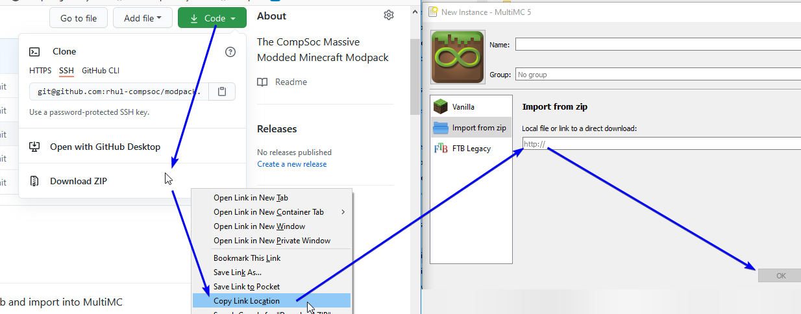

# modpack

Right click "Downlaod ZIP" on GitHub and import into MultiMC

## Technical Support

For technical support, try the `🎮 | minecraft` channel on Discord.

## Mods

<ul>
<li><a href="https://www.curseforge.com/minecraft/mc-mods/waddles">Waddles (by Girafi)</a></li>
<li><a href="https://www.curseforge.com/minecraft/mc-mods/integrated-nbt">Integrated NBT (by scleox)</a></li>
<li><a href="https://www.curseforge.com/minecraft/mc-mods/rftools-power">RFTools Power (by McJty)</a></li>
<li><a href="https://www.curseforge.com/minecraft/mc-mods/create">Create (by simibubi)</a></li>
<li><a href="https://www.curseforge.com/minecraft/mc-mods/ae2-extras">AE2 Extras (by tfarecnim)</a></li>
<li><a href="https://www.curseforge.com/minecraft/mc-mods/macaws-roofs">Macaw's Roofs (by sketch_macaw)</a></li>
<li><a href="https://www.curseforge.com/minecraft/mc-mods/thermal-cultivation">Thermal Cultivation (by TeamCoFH)</a></li>
<li><a href="https://www.curseforge.com/minecraft/mc-mods/simply-jetpacks-2">Simply Jetpacks 2 (by Tomson124)</a></li>
<li><a href="https://www.curseforge.com/minecraft/mc-mods/biggerreactors">Bigger Reactors (by RogueLogix)</a></li>
<li><a href="https://www.curseforge.com/minecraft/mc-mods/botania">Botania (by Vazkii)</a></li>
<li><a href="https://www.curseforge.com/minecraft/mc-mods/pams-harvestcraft-2-trees">Pam's HarvestCraft 2 - Trees (by pamharvestcraft)</a></li>
<li><a href="https://www.curseforge.com/minecraft/mc-mods/tinkers-mechworks">Tinkers' Mechworks (by mDiyo)</a></li>
<li><a href="https://www.curseforge.com/minecraft/mc-mods/pams-harvestcraft-2-food-extended">Pam's HarvestCraft 2 - Food Extended (by pamharvestcraft)</a></li>
<li><a href="https://www.curseforge.com/minecraft/mc-mods/thermal-foundation">Thermal Foundation (by TeamCoFH)</a></li>
<li><a href="https://www.curseforge.com/minecraft/mc-mods/ftb-gui-library">FTB GUI Library (by FTB)</a></li>
<li><a href="https://www.curseforge.com/minecraft/mc-mods/mekanism-additions">Mekanism Additions (by bradyaidanc)</a></li>
<li><a href="https://www.curseforge.com/minecraft/mc-mods/mekanism">Mekanism (by bradyaidanc)</a></li>
<li><a href="https://www.curseforge.com/minecraft/mc-mods/ftb-teams">FTB Teams (by FTB)</a></li>
<li><a href="https://www.curseforge.com/minecraft/mc-mods/mekanism-generators">Mekanism Generators (by bradyaidanc)</a></li>
<li><a href="https://www.curseforge.com/minecraft/mc-mods/mekanism-tools">Mekanism Tools (by bradyaidanc)</a></li>
<li><a href="https://www.curseforge.com/minecraft/mc-mods/cofh-core">CoFH Core (by TeamCoFH)</a></li>
<li><a href="https://www.curseforge.com/minecraft/mc-mods/thermal-expansion">Thermal Expansion (by TeamCoFH)</a></li>
<li><a href="https://www.curseforge.com/minecraft/mc-mods/ultimate-car-mod">Ultimate Car Mod (by henkelmax)</a></li>
<li><a href="https://www.curseforge.com/minecraft/mc-mods/advanced-mining-dimension">Advanced Mining Dimension (by henkelmax)</a></li>
<li><a href="https://www.curseforge.com/minecraft/mc-mods/rftools-control">RFTools Control (by McJty)</a></li>
<li><a href="https://www.curseforge.com/minecraft/mc-mods/waystones">Waystones (by BlayTheNinth)</a></li>
<li><a href="https://www.curseforge.com/minecraft/mc-mods/useful-railroads">Useful Railroads (by HyCraftHD)</a></li>
<li><a href="https://www.curseforge.com/minecraft/mc-mods/rftools-builder">RFTools Builder (by McJty)</a></li>
<li><a href="https://www.curseforge.com/minecraft/mc-mods/integrated-dynamics">Integrated Dynamics (by kroeser)</a></li>
<li><a href="https://www.curseforge.com/minecraft/mc-mods/tool-belt">Tool Belt (by gigaherz)</a></li>
<li><a href="https://www.curseforge.com/minecraft/mc-mods/integrated-terminals">Integrated Terminals (by kroeser)</a></li>
<li><a href="https://www.curseforge.com/minecraft/mc-mods/trample-stopper">Trample Stopper (by UnRealDinnerbone)</a></li>
<li><a href="https://www.curseforge.com/minecraft/mc-mods/bookshelf">Bookshelf (by DarkhaxDev)</a></li>
<li><a href="https://www.curseforge.com/minecraft/mc-mods/cc-tweaked">CC: Tweaked (by SquidDev)</a></li>
<li><a href="https://www.curseforge.com/minecraft/mc-mods/kubejs-ui">KubeJS UI (by LatvianModder)</a></li>
<li><a href="https://www.curseforge.com/minecraft/mc-mods/global-xp">Global XP (by bl4ckscor3)</a></li>
<li><a href="https://www.curseforge.com/minecraft/mc-mods/integrated-tunnels">Integrated Tunnels (by kroeser)</a></li>
<li><a href="https://www.curseforge.com/minecraft/mc-mods/openblocks-elevator">OpenBlocks Elevator (by vsngarcia)</a></li>
<li><a href="https://www.curseforge.com/minecraft/mc-mods/dimstorage">DimStorage (by 3divad99)</a></li>
<li><a href="https://www.curseforge.com/minecraft/mc-mods/building-gadgets">Building Gadgets (by Direwolf20)</a></li>
<li><a href="https://www.curseforge.com/minecraft/mc-mods/rftools-base">RFTools Base (by McJty)</a></li>
<li><a href="https://www.curseforge.com/minecraft/mc-mods/ultimate-plane-mod">Ultimate Plane Mod (by henkelmax)</a></li>
<li><a href="https://www.curseforge.com/minecraft/mc-mods/ftb-backups">FTB Backups (by FTB)</a></li>
<li><a href="https://www.curseforge.com/minecraft/mc-mods/ftb-chunks">FTB Chunks (by FTB)</a></li>
<li><a href="https://www.curseforge.com/minecraft/mc-mods/light-overlay">Light Overlay (Rift/Forge/Fabric) (by shedaniel)</a></li>
<li><a href="https://www.curseforge.com/minecraft/mc-mods/morph-o-tool">Morph-o-Tool (by Vazkii)</a></li>
<li><a href="https://www.curseforge.com/minecraft/mc-mods/rftools-storage">RFTools Storage (by McJty)</a></li>
<li><a href="https://www.curseforge.com/minecraft/mc-mods/rhino">Rhino (by LatvianModder)</a></li>
<li><a href="https://www.curseforge.com/minecraft/mc-mods/carry-on">Carry On (by Tschipp)</a></li>
<li><a href="https://www.curseforge.com/minecraft/mc-mods/extrastorage">ExtraStorage (by 3divad99)</a></li>
<li><a href="https://www.curseforge.com/minecraft/mc-mods/refined-storage">Refined Storage (by raoulvdberge)</a></li>
<li><a href="https://www.curseforge.com/minecraft/mc-mods/jei-integration">JEI Integration (by SnowShock35)</a></li>
<li><a href="https://www.curseforge.com/minecraft/mc-mods/spice-of-life-carrot-edition">Spice of Life: Carrot Edition (by lordcazsius)</a></li>
<li><a href="https://www.curseforge.com/minecraft/mc-mods/curios">Curios API (Forge) (by TheIllusiveC4)</a></li>
<li><a href="https://www.curseforge.com/minecraft/mc-mods/xnet">XNet (by McJty)</a></li>
<li><a href="https://www.curseforge.com/minecraft/mc-mods/immersive-engineering">Immersive Engineering (by BluSunrize)</a></li>
<li><a href="https://www.curseforge.com/minecraft/mc-mods/kubejs">KubeJS (by LatvianModder)</a></li>
<li><a href="https://www.curseforge.com/minecraft/mc-mods/common-capabilities">Common Capabilities (by kroeser)</a></li>
<li><a href="https://www.curseforge.com/minecraft/mc-mods/u-team-core">U Team Core (by HyCraftHD)</a></li>
<li><a href="https://www.curseforge.com/minecraft/mc-mods/macaws-bridges">Macaw's Bridges (by sketch_macaw)</a></li>
<li><a href="https://www.curseforge.com/minecraft/mc-mods/projecte">ProjectE (by SinKillerJ)</a></li>
<li><a href="https://www.curseforge.com/minecraft/mc-mods/quark">Quark (by Vazkii)</a></li>
<li><a href="https://www.curseforge.com/minecraft/mc-mods/industrial-foregoing">Industrial Foregoing (by Buuz135)</a></li>
<li><a href="https://www.curseforge.com/minecraft/mc-mods/autoreglib">AutoRegLib (by Vazkii)</a></li>
<li><a href="https://www.curseforge.com/minecraft/mc-mods/macaws-furniture">Macaw's Furniture (by sketch_macaw)</a></li>
<li><a href="https://www.curseforge.com/minecraft/mc-mods/torchmaster">Torchmaster (by xalcon)</a></li>
<li><a href="https://www.curseforge.com/minecraft/mc-mods/architectury-forge">Architectury API (Forge) (by shedaniel)</a></li>
<li><a href="https://www.curseforge.com/minecraft/mc-mods/mcjtylib">McJtyLib (by McJty)</a></li>
<li><a href="https://www.curseforge.com/minecraft/mc-mods/mantle">Mantle (by mDiyo)</a></li>
<li><a href="https://www.curseforge.com/minecraft/mc-mods/crash-utilities">Crash Utilities (by Darkere)</a></li>
<li><a href="https://www.curseforge.com/minecraft/mc-mods/ftb-essentials">FTB Essentials (by FTB)</a></li>
<li><a href="https://www.curseforge.com/minecraft/mc-mods/biomes-o-plenty">Biomes O' Plenty (by Forstride)</a></li>
<li><a href="https://www.curseforge.com/minecraft/mc-mods/compact-machines">Compact Machines (by davenonymous)</a></li>
<li><a href="https://www.curseforge.com/minecraft/mc-mods/controlling">Controlling (by Jaredlll08)</a></li>
<li><a href="https://www.curseforge.com/minecraft/mc-mods/macaws-paintings">Macaw's Paintings (by sketch_macaw)</a></li>
<li><a href="https://www.curseforge.com/minecraft/mc-mods/rs-requestify">Refined Storage: Requestify (by Buuz135)</a></li>
<li><a href="https://www.curseforge.com/minecraft/mc-mods/rftools-dimensions">RFTools Dimensions (by McJty)</a></li>
<li><a href="https://www.curseforge.com/minecraft/mc-mods/cyclic">Cyclic (by Lothrazar)</a></li>
<li><a href="https://www.curseforge.com/minecraft/mc-mods/simple-magnets">Simple Magnets (by SuperMartijn642)</a></li>
<li><a href="https://www.curseforge.com/minecraft/mc-mods/libx">LibX (by noeppinoeppi)</a></li>
<li><a href="https://www.curseforge.com/minecraft/mc-mods/compactstorage">CompactStorage (by tobyystrong)</a></li>
<li><a href="https://www.curseforge.com/minecraft/mc-mods/thermal-locomotion">Thermal Locomotion (by TeamCoFH)</a></li>
<li><a href="https://www.curseforge.com/minecraft/mc-mods/mod-name-tooltip">Mod Name Tooltip (by mezz)</a></li>
<li><a href="https://www.curseforge.com/minecraft/mc-mods/snad-back-to-the-past">Snad - Back to the past (by lazynessmind)</a></li>
<li><a href="https://www.curseforge.com/minecraft/mc-mods/dank-storage">Dank Storage (by tfarecnim)</a></li>
<li><a href="https://www.curseforge.com/minecraft/mc-mods/appleskin">AppleSkin (by squeek502)</a></li>
<li><a href="https://www.curseforge.com/minecraft/mc-mods/enderchests">EnderChests (by ShetiPhian)</a></li>
<li><a href="https://www.curseforge.com/minecraft/mc-mods/phosphophyllite">Phosphophyllite (by RogueLogix)</a></li>
<li><a href="https://www.curseforge.com/minecraft/mc-mods/jei">Just Enough Items (JEI) (by mezz)</a></li>
<li><a href="https://www.curseforge.com/minecraft/mc-mods/cloth-config-forge">Cloth Config API (Forge) (by shedaniel)</a></li>
<li><a href="https://www.curseforge.com/minecraft/mc-mods/macaws-windows">Macaw's Windows (by sketch_macaw)</a></li>
<li><a href="https://www.curseforge.com/minecraft/mc-mods/reauth">ReAuth (by TechnicianLP)</a></li>
<li><a href="https://www.curseforge.com/minecraft/mc-mods/default-options">Default Options (by BlayTheNinth)</a></li>
<li><a href="https://www.curseforge.com/minecraft/mc-mods/patchouli">Patchouli (by Vazkii)</a></li>
<li><a href="https://www.curseforge.com/minecraft/mc-mods/jumbo-furnace">Jumbo Furnace (by Commoble)</a></li>
<li><a href="https://www.curseforge.com/minecraft/mc-mods/thermal-innovation">Thermal Innovation (by TeamCoFH)</a></li>
<li><a href="https://www.curseforge.com/minecraft/mc-mods/randompatches-forge">RandomPatches (Forge) (by TheRandomLabs)</a></li>
<li><a href="https://www.curseforge.com/minecraft/mc-mods/applied-energistics-2">Applied Energistics 2 (by AlgorithmX2)</a></li>
<li><a href="https://www.curseforge.com/minecraft/mc-mods/save-my-stronghold">Save My Stronghold! (Forge) (by YUNGNICKYOUNG)</a></li>
<li><a href="https://www.curseforge.com/minecraft/mc-mods/shetiphiancore">ShetiPhianCore (by ShetiPhian)</a></li>
<li><a href="https://www.curseforge.com/minecraft/mc-mods/macaws-doors">Macaw's Doors (by sketch_macaw)</a></li>
<li><a href="https://www.curseforge.com/minecraft/mc-mods/pams-harvestcraft-2-crops">Pam's HarvestCraft 2 - Crops (by pamharvestcraft)</a></li>
<li><a href="https://www.curseforge.com/minecraft/mc-mods/macaws-trapdoors">Macaw's Trapdoors (by sketch_macaw)</a></li>
<li><a href="https://www.curseforge.com/minecraft/mc-mods/dark-utilities">Dark Utilities (by DarkhaxDev)</a></li>
<li><a href="https://www.curseforge.com/minecraft/mc-mods/pams-harvestcraft-2-food-core">Pam's HarvestCraft 2 - Food Core (by pamharvestcraft)</a></li>
<li><a href="https://www.curseforge.com/minecraft/mc-mods/runelic">Runelic (by DarkhaxDev)</a></li>
<li><a href="https://www.curseforge.com/minecraft/mc-mods/rftools-utility">RFTools Utility (by McJty)</a></li>
<li><a href="https://www.curseforge.com/minecraft/mc-mods/titanium">Titanium (by hrznstudio)</a></li>
<li><a href="https://www.curseforge.com/minecraft/mc-mods/cyclops-core">Cyclops Core (by kroeser)</a></li>
<li><a href="https://www.curseforge.com/minecraft/mc-mods/storage-drawers">Storage Drawers (by Texelsaur)</a></li>
<li><a href="https://www.curseforge.com/minecraft/mc-mods/travel-anchors">Travel Anchors (by CastCrafter)</a></li>
<li><a href="https://www.curseforge.com/minecraft/mc-mods/clumps">Clumps (by Jaredlll08)</a></li>
<li><a href="https://www.curseforge.com/minecraft/mc-mods/chisels-bits">Chisels & Bits (by AlgorithmX2)</a></li>
<li><a href="https://www.curseforge.com/minecraft/mc-mods/integrated-crafting">Integrated Crafting (by kroeser)</a></li>
<li><a href="https://www.curseforge.com/minecraft/mc-mods/xnet-gases">XNet Gases (by Terrails)</a></li>
<li><a href="https://www.curseforge.com/minecraft/mc-mods/supermartijn642s-config-lib">SuperMartijn642's Config Lib (by SuperMartijn642)</a></li>
<li><a href="https://www.curseforge.com/minecraft/mc-mods/netherportalfix">NetherPortalFix (by BlayTheNinth)</a></li>
</ul>

